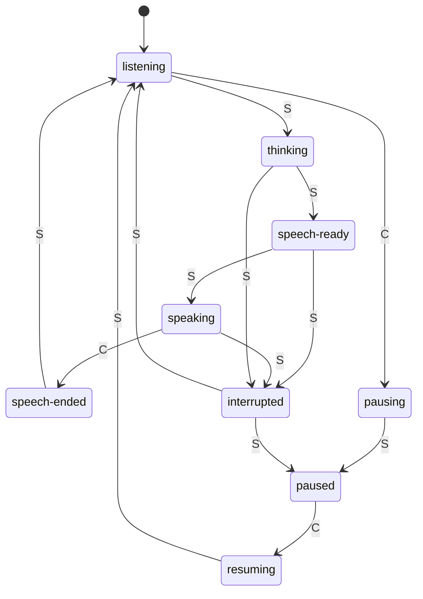

*Authored by Claude Sonnet 5.5 (Anthropic), with Steven Chock as co-author.*

# Cue transitions

Expands the `/* Transitions */` list in [`page-flow.md`](page-flow.md). That list stays the compact, machine-readable source (the OpenAPI `x-transitions` mirrors it). This file explains each edge. Where the sources are silent, the text says **Open** or **Proposal**, so Steven knows which parts need his judgment first.

Sources: `page-flow.md` (comments on `CueType`, `ServerCue`, `ClientCue`), `specs/page-flow.md` (status section), `SPEC.md` section 4.

## Diagram

Solid labels name who sends the cue: **S** is the server, **C** is the client.

Three loops are worth seeing at a glance:

- **Turn loop:** `listening → thinking → speech-ready → speaking → speech-ended → listening`.
- **Interruption exit:** any state where the AI is not listening can go to `interrupted`, which resolves back to `listening`.
- **Pause loop:** `listening → pausing → paused → resuming → listening`.

## Transition table

"Sent by" is who emits the cue that causes the transition. `ServerCue` and `ClientCue` are defined in `page-flow.md`.

| # | From → To | Sent by | Trigger | Guard and timing | Payload |
|---|---|---|---|---|---|
| 1 | `listening → thinking` | Server | The user's speech has ended naturally | Server waits `waitCadence` after the user goes quiet | `thinking` (no fields) |
| 2 | `thinking → speech-ready` | Server | The response is ready to speak | Lead-in cues fire from `cadence` | `cadence` (when the AI will start) |
| 3 | `speech-ready → speaking` | Server | `cadence` elapsed | None beyond `cadence` | `transcript`, `audioStream` |
| 4 | `speaking → speech-ended` | Client | The last audio frame has played | `guard` (tells a gap in speech from the end of it), then `transition` (lets audio and visual cues finish), plus `screenReaderPadding` when set | `guard`, `transition`, `screenReaderPadding` |
| 5 | `speech-ended → listening` | Server | The Listener is ready for the user's turn | Guards release only after the server answers `listening` | `waitCadence` |
| 6 | `thinking`, `speech-ready` or `speaking → interrupted` | Server | The user speaks over the AI, or a pause is requested while the AI is not listening | None | `interrupted` (no fields) |
| 7 | `interrupted → listening` | Server | The server has worked out where to re-enter the interview | Server-owned; no client guard | `waitCadence` |
| 8 | `listening → pausing` | Client | The user presses pause | None | `pausing` (no fields) |
| 9 | `pausing → paused` | Server | The server confirms it entered a paused state | None | `paused` (no fields) |
| 10 | `interrupted → paused` | Server | The user paused while the AI was not listening | None | `paused` (no fields) |
| 11 | `paused → resuming` | Client | The user presses resume | None | `resuming` (no fields) |
| 12 | `resuming → listening` | Server | The AI is back where it needs to be | None | `waitCadence` |

## What the user sees

The page-flow status section has four statuses. Each cue maps to one displayed status, which is what announcements follow (CUE-ANN-001).

| Cue | Displayed as | Why |
|---|---|---|
| `listening` | Listening (your turn) | Direct |
| `speech-ended` | Listening | "Speech has ended on the Client" is listed under Listening |
| `interrupted` | Listening | `CueType` comment: interrupted is displayed as "listening" |
| `thinking` | Thinking | Direct |
| `speech-ready` | Thinking | "Interviewer is thinking or finished thinking" |
| `pausing` | Thinking | "Session is pausing" |
| `resuming` | Thinking | "Session is resuming" |
| `speaking` | Talking | Direct |
| `paused` | Idle | "Server paused or session not started" |

Notes that follow from the table:

- A **false cutoff** (the user resumes after `thinking` starts) goes `thinking → interrupted → listening`, and the user sees Listening, Thinking, Listening. SPEC 4.3 already says a flip like this inside a second announces nothing new.
- While `interrupted` resolves, the UI holds or obscures the captions and any other indicators it was showing, because the AI takes a while to decide how to re-enter.
- `pausing` and `resuming` show Thinking so the user has a cue while the server confirms the state change.

## Rules each transition must respect

- **One state at a time** (CUE-STA-001). The state comes from the event stream, not from the renderer.
- **Hand-off is distinct** (CUE-STA-003). Rows 5, 7 and 12 all end in `listening`, so the "your turn" cue (chime plus ear bubble) must play on arrival, whichever row got there.
- **Cues never lead the audio they describe** (CUE-MOD-004). In `perceived` mode, rows 2 and 3 are shown when the delayed audio arrives.
- **Tail clipping is not repaired** (CUE-MOD-005). Row 4 fires when the clipped audio ends.
- **Pause must interrupt the AI if it is not listening** (`CueType` comment). That is row 6 followed by row 10.

## Open

1. **Pausing from a non-listening state.** The list has no `speaking → pausing`, `thinking → pausing` or `speech-ready → pausing`. The `CueType` comment says a pause request interrupts the AI, so the path looks like `interrupted → paused`, which skips `pausing` and its Thinking cue. **Proposal:** keep that path (row 10), and have the client show Thinking itself from the moment the user presses pause, so the cue is the same on both paths. Needs Steven's decision.
2. **Faux "thinking" after `speech-ended`.** The existing TODO: the AI may not be ready to listen when the guards run out. **Proposal:** none yet. Option A is a client-side Thinking cue until the server answers `listening`. Option B is a server `thinking` cue, which would need a `speech-ended → thinking` edge. A changes no transitions.
3. **Start and end.** The list has no entry state. The diagram assumes the session starts in `listening`, but `specs/page-flow.md` says Idle covers "session not started". **Proposal:** add a `not-started` state, or treat the first `speech-ready` as the entry. Interview end is also not modelled.
4. **Pause during the `speech-ended` guard window.** The guard window is client-owned, and the list gives `speech-ended` only one exit. Unspecified whether pause during the guard is queued or cancels it.
5. **No server timeout.** If the server never answers `listening` after row 4, the guards never release. No recovery path is defined (see `Recovery.dc.html` in `design/mockups/ui/` for the connection-loss design).
